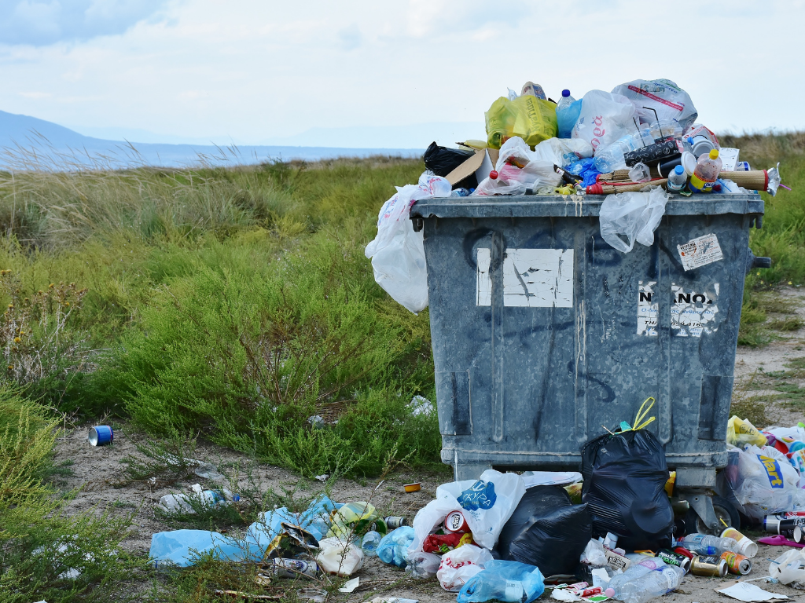
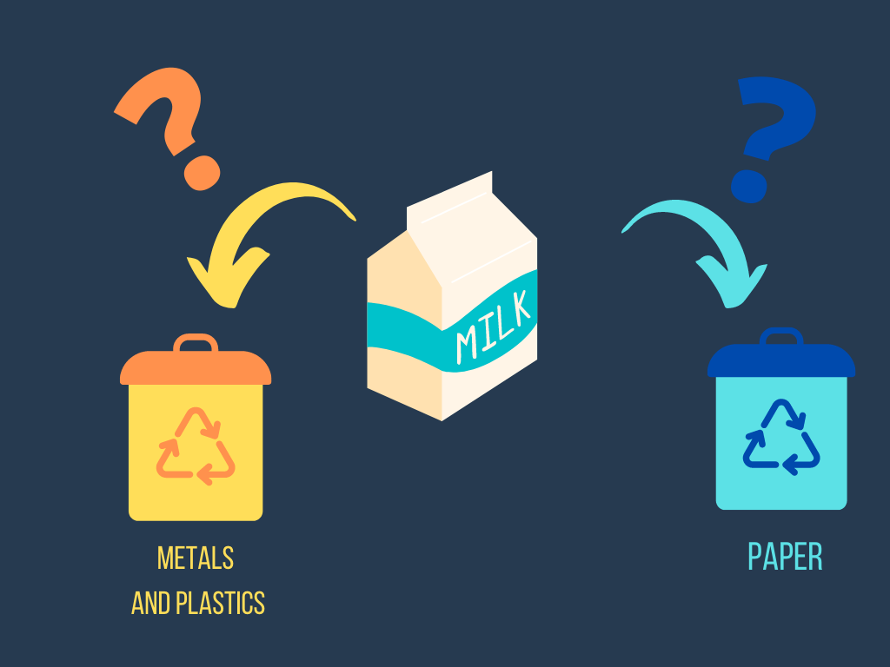
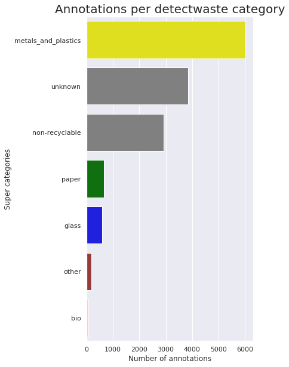

# The beginning

We're happy to announce that Our project finally started! Just a quick reminder: detect waste is a non-profit, ecological project that aims to use Artificial Intelligence for the general good. We've gathered ten team members and five mentors to work together on the problem of the world's waste pollution.

In the next 5 months, we will meet together online and work in 2-weeks sprints on object detection. But, at first, let's take a closer look at the problem!

## What kind of waste do we have?

Waste pollution is one of the biggest environmental issues in the modern world. The massive production of disposable goods in the last years resulted in an exponential increase in produced waste. It’s frightening how much waste we produce – it's about **2 billion tons every year** In these times, every single thing that we buy must be covered with some wrapping. Sometimes even peeled fruits are put into a plastic bag.

However, our awareness is growing - we’re trying to reduce the amount of garbage and recycle as much as we can, but recycling isn’t as simple as it seems. It is essential to know where to put the trash if we want our work to make sense.

### Waste categories

The *detect waste* project was funded by a group of ten Polish programmers, who decided to work together on the problem of waste in Poland. Our first important decision was to choose the categories of waste we want to detect. Waste management policies vary around the globe. Each country has its own regulations concerning recycling.

After a long discussion, we have decided to keep with the official Waste segregation principles in Gdańsk, Poland.

Right now, in Gdańsk we have five main waste categories:

1. paper

2. glass

3. metal and plastic

4. bio

5. non-recyclable

Additionaly, there are types of waste that does not fall into any of those categories I.e., batteries, tires or electric devices. We’ve created another category for it other (6).

## Recycling can be complicated.

Many individuals struggle with proper recycling, mostly due to a lack of knowledge. A huge number of everyday items cannot be easily recycled or reused. For instance, old magazine papers, blister packs, or greasy pizza boxes are officially non-recyclable. It is important not to mix them with paper or metals, because all this segregation process loses meaning.

The other interesting fact is that recycling can also vary by the city or company responsible for waste management. For example, the same kind of trash may be classified into different categories: such as milk carton that should be put into the Metals and Plastic category in Gdańsk but into Paper in Łódź.

### Waste thrown into environment

Unfortunately, not every waste ends in the litter bins. A lot of people throw them away on the street, on the beach or in the woods. There’s a simple rule – **you brought, you take away!**

We are working on the TACO dataset, in which there is a great number of pictures of garbage thrown into the environment. Sometimes they lay there so long that it is hard to recognize what it is. And remember plastic may **degrade from 100 to even 1000 years!**

### Handful of statistics

We believe that this dataset may give some perspective to the overall problem with waste in environment. The overwhelming majority of this wastes falls in the category of metals and plastic, but there are also a lot of trashes that can’t be recycled.

Sources: 
[Degrade time](https://esbud.pl/zycie-smieci-jak-dlugo-rozkladaja-sie-odpady/)
[Amount of wastes](https://odpady.net.pl/2020/09/23/smieci-to-ogromny-problem-naszych-czasow-jak-walczy-sie-z-nim-w-polsce-i-na-swiecie/)
