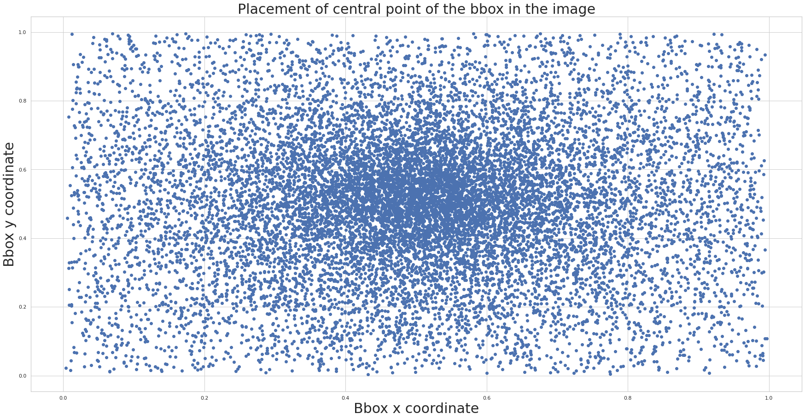
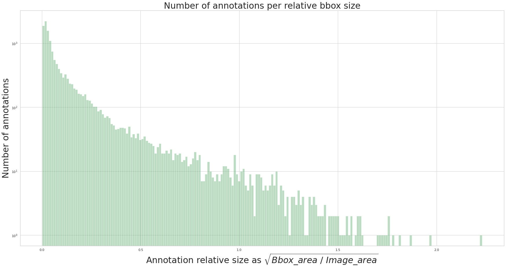

# Detect waste dataset

First and most important thing that is needed in any Machine Learning project is data. And usually, the more the better.

Data must be well-prepared: with good class balance, decent quality and proper annotation. They say: “**90% work on ML problem is data processing**”.

Let’s see if it’s true.

### Taco dataset

In Our project we are using [TACO dataset](tacodataset.org) - it’s an open image dataset of waste in the environment.

We’ve managed to download over 4600 images – from which 1500 were annotated in [COCO format](https://detectwaste.ml/post/01-introduction/).


### Detect waste dataset

As we decided to work on seven categories:

1. Metals and Plastic

2. Paper

3. Glass

4. Bio

5. Non-recyclable

6. Other

7. Unknown

We've decided to convert TACO categories to detect waste categories according to segregation rules obligatory in Gdańsk. You can see conversion script below:

**Step 1.** Manually assign categories from TACO to detectwaste

```python

def taco_to_detectwaste(label):
    glass = ['Glass bottle','Broken glass','Glass jar']
    metals_and_plastics = ['Aluminium foil', "Clear plastic bottle","Other plastic bottle",
                         "Plastic bottle cap","Metal bottle cap","Aerosol","Drink can",
                         "Food can","Drink carton","Disposable plastic cup","Other plastic cup",
                         "Plastic lid","Metal lid","Single-use carrier bag","Polypropylene bag",
                         "Plastic Film","Six pack rings","Spread tub","Tupperware",
                         "Disposable food container","Other plastic container",
                         "Plastic glooves","Plastic utensils","Pop tab","Scrap metal",
                         "Plastic straw","Other plastic", "Plastic film", "Food Can"]
    
    non_recyclable = ["Aluminium blister pack","Carded blister pack",
                    "Meal carton","Pizza box","Cigarette","Paper cup",
                    "Meal carton","Foam cup","Glass cup","Wrapping paper",
                    "Magazine paper","Garbage bag","Plastified paper bag",
                    "Crisp packet","Other plastic wrapper","Foam food container",
                    "Rope","Shoe","Squeezable tube","Paper straw","Styrofoam piece", "Rope & strings", "Tissues"]
    
    other = ["Battery"]
    paper = ["Corrugated carton","Egg carton","Toilet tube","Other carton", "Normal paper", "Paper bag"]
    bio = ["Food waste"]
    unknown = ["Unlabeled litter"]

    if (label in glass):
            label="glass"
    elif (label in metals_and_plastics):
            label="metals_and_plastics"
    elif(label in non_recyclable):
            label="non-recyclable"
    elif(label in other):
            label="other"
    elif (label in paper):
            label="paper"
    elif(label in bio):
            label="bio"
    elif(label in unknown):
            label="unknown"
    else:
        print(label, "is non-taco label")
        label = "unknown"
    return label

```

**Step 2.** Use function to convert annotations to desired form

```python

# convert all taco anns to detect-waste anns
# let's change supercategory to detectwaste
detectwaste_categories = dataset['categories']
for ann in anns:
    cat_id = ann['category_id']
    cat_taco = categories[cat_id]['name']
    detectwaste_categories[cat_id]['supercategory'] = taco_to_detectwaste(cat_taco)
    
```

The rest of images were annotated in COCO format by [Epinote]( https://epinote.ai/] - our partner.

Reassuming we’ve gathered over 4600 annotated images. For each image there is list of bounding boxes - one for each object with proper label.

### Dataset analysis

It’s extremely important to get to know how your dataset looks. It might be useful during system evaluation. Sometimes it happens that misclassification or other errors are caused by the imbalanced dataset or some wrong annotations. First thing that we’ve done was extracting from the dataset as much information as we could. Here are a few diagrams representing vital statistics.

To prevent the negative effects of data imbalance in our dataset, first we have to know how many images we have in each category. As you can see most of the trash found in our dataset is *metals and plastics*. Unfortunately, the second numerously represented category is *unknown* - the litter probably so decomposed that is hard to classify. This makes our dataset highly imbalanced and will require special attention in future.

```python
# Count annotations

for ann in anns_detectwaste:
    cat_id = ann['category_id']
    detectwaste_cat_histogram[cat_id] +=1

# Initialize the matplotlib figure
f, ax = plt.subplots(figsize=(5,10))

# Convert to DataFrame
d ={'Super categories': detectwaste_cat_names, 'Number of annotations': detectwaste_cat_histogram}
df = pd.DataFrame(d)
df = df.sort_values('Number of annotations', 0, False)

sns.set_palette(sns.color_palette(colors_recykling))
plot_1 = sns.barplot(x="Number of annotations", y="Super categories", data=df,
            label="Total")
plot_1.set_title('Annotations per detectwaste category',fontsize=20)

```


Information about number of objects per image also might be helpful during detection process. We need to know if the majority of images have only a single object or a few.

```python

for img in dataset['images']:
    annotations_per_image = []
    for i in range(0, len(anns_detectwaste)):
        if img['id'] == anns_detectwaste[i]['image_id']:
            annotations_per_image.append(anns_detectwaste[i]['id'])
    nr_annotation_per_image.append(len(annotations_per_image))       
plt.figure(figsize=(20,7))
ax = sns.distplot(nr_annotation_per_image,kde=False,bins=100, color='g')
ax.set_yscale('log')
ax.set(xlabel='Number of annotations per image', ylabel='Image Count')

```


Some ML architectures require exact image size as an input, so it is worth to what size our data have so we could properly resize them. It also a good indicator of our general data quality.


To prevent some errors, knowing where most of objects occur in the image might be a useful information. For instance, if our objects appear only in the center of an image, we should consider applying data augmentation methods to make detector recognize objects in any place on the image.

Interestingly, in our case most of the objects are in the center. It might be due to the fact that also most images have only single object, typically in the center. In case of numerous objects, they usually are scattered through the whole image.

```python

for i in range(0, len(anns_detectwaste)):
    for j in range (0, len(dataset['images'])):
        if dataset['images'][j]['id'] == anns_detectwaste[i]['image_id']:
            
            center_x.append((anns_detectwaste[i]['bbox'][0]+anns_detectwaste[i]['bbox'][2]/2)/dataset['images'][j]['width'])
            center_y.append((anns_detectwaste[i]['bbox'][1]+anns_detectwaste[i]['bbox'][3]/2)/dataset['images'][j]['height'])

plt.plot(center_x, center_y, 'bo')
plt.title('Placement of central point of the bbox in the image')
plt.show()

```



Also, the size of bounding boxes is essential – we need to know if we will deal mostly with small or rather bigger objects. It is a well-known fact that even state-of-the-art detectors don’t work well with small objects.


As our images vary in size, the bounding box size is also relative. It is worth to know how many annotations we have per different bounding box sizes.



After this analysis we could start object detection process.

To sum up:

* Noticeable class-imbalance:
	* we will have to try out some data augmentation methods or weighted loss functions
	* we have to take that into account when preparing dataset splits

* A lot of small objects - have to try architectures that are better with dealing with it
* Many images in the “unknown” category – have to try to cut bounding boxes and train classifier. Then classify those unknown objects to get approximate categories

You can find the source code [here](https://github.com/wimlds-trojmiasto/detect-waste/blob/main/notebooks/exploratory-data-analysis.ipynb)
