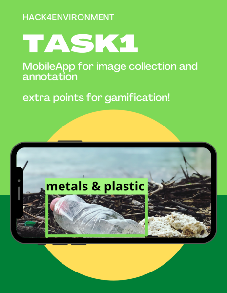

# Hack4Enviroment - summary

Scientists have found that humans consume up to 250 grams of microplastic each year. That's two and a half bars of chocolate a year. Just the plastic kind. Almost 90 percent of that plastic comes from bottled and tap water.
Each of us each uses more than 100 kg of plastic products every year. Much of it is neither disposed of nor recycled. Left by the roadside, in the forest or thrown into a water, it pollutes the environment and harms the entire ecosystem. What's more, we only have 30 years left for the amount of trash in the ocean to be greater than the number of sea creatures. And it's up to us what we do with that time.

8-9th January took place hackathon Hack4Enviroment. It was inspired and organized by DIH4 AI (Digital Innovation Hub). The idea was to support our project *detect waste in Pomerania* organized by Women in Machine Learning & Data Science.

The aim of the hackathon was to complete one of the task within 24 hours. Participants also had the opportunity to participate in lectures regarding artificial intelligence and programming. The honorary patronage was assumed by the President of the City of Gdańsk. The sponsor was Intel, and the media patrons were: [Epinote](https://epinote.ai/), [Neptune.ai](https://neptune.ai/), [Stowarzyszenie.ai](https://stowarzyszenie.ai/) and [Zakład Utylizacyjny](https://zut.com.pl/).
There were also partners: szostek_bar i partnerzy and Maruta.

## What is hackathon?

Acording to wikipedia aa hackathon is a design sprint-like event; often, in which computer programmers and others involved in software development, including graphic designers, interface designers, project managers, domain experts, and others collaborate intensively on software projects.

The goal of a hackathon is to create functioning software or hardware by the end of the event. Hackathons tend to have a specific focus, which can include the programming language used, the operating system, an application, an API, or the subject and the demographic group of the programmers. In other cases, there is no restriction on the type of software being created. Some hackathons focus on a particular platform such as mobile apps, a desktop operating system, web development or video game development.

### Tasks - Hack4Enviroment

* The first was to create a mobile application supporting the DetectWaste initiative and allowing taking and annotating of photos showing wastes in the environment.

This mobile app will allow everyone to eaisly join and support the project detectwaste.ml: by taking a photo of plastic or other waste around us (on the beach, in the forest, in the river or sea, in the city), sending the photo through the app. A larger number of images makes training of AI model easier. This, in the future, can support the fight for environmental cleanliness, including our native Baltic Sea.

* The second was  to create a program that, based on the content and the number of photos of wastes with location data, will identify and display illegal dumping on the map.

According to [wikipedia](https://en.wikipedia.org/wiki/Illegal_dumping) effects of illegal dumping include health, environmental, and economic consequences. While legal waste disposal locations, such as landfills, are designed to contain waste and its byproducts from infiltrating the surrounding environment, illegal dumping areas do not typically incorporate the same safeguards. Due to this, illegal dumping may sometimes lead to pollution of the surrounding environment. Toxins or hazardous materials infiltrating soil and drinking water threaten the health of local residents.Additionally, illegal dump sites that catch fire pollute the air with toxic particles. Beyond negative health outcomes due to pollution and toxic waste, illegal dumps pose a physical threat. Unstable piles of material and exposed nails threaten harm to humans, specifically children who may be attracted to illegal dumps as play areas.

According to the United States Environmental Protection Agency, **waste attracts more waste**. Therefore, cleaning up existing illegal dumps is a helpful deterrent for additional illegal dumping.

# Participants
### A little bit of statistics from the event

17 teams applied, 13 was present to the end of the hackathon - 63 people signed up for the hackathon. During whole hackathon they can contact with mentors and also participate in prelections. The solutions of tasks are during revision.

# Lectures
The conducted lectures regarding: EU regulation regarding artificial intelligence, object detection: Azure Cognitive Services, law in AI, AI in medicine and health service, good practices of implementing services based on AI algorithms in the organization and also AI in data analysis.

# Winners
Jury have selected three teams of winners per each task.

### Task 1

* **I prize: Artur Formella, Klaudia Formella-Mróz**
* II prize: Paweł Recław, Piotr Recław, Agata Recław, Bartosz Multan
* III prize: Michał Marciniak, Szymon Niemczyk, Stanisław Zamora, Paweł Żbikowski

### Task 2
* **I prize: Mateusz Piechocki, Łukasz Pięta, Bartosz Ptak, Piotr Wyrwiński, Cezary Waligóra**
* II prize: Paulina Przychodzeń, Agnieszka Lewicka, Michał Kazula, Michał Dolecki,Michał Przychodzeń
* III prize: Szymon Janowski, Marcin Hradowicz, Bartosz Mikulski

**Special prize:**
  1. Katarzyna Sornat,
  2. Jędrzej Świeżewski, Dominik Krzemiński

# People
Hackthon ended successfully thanks to our Hack4environment team. We would like to thank everyone for the big support.

**Organizers:** Mateusz Dyrda, Agata Dymna, Weronika Recław - z DiH4.AI.

**Jury:** Jacek Kawalec (DIH4.AI), Zenon Szczepkowski (DIH4.AI), Mateusz Dyrda (DIH4.AI), Ewa Marczewska (WIMLDS, detectwaste.ml), Magdalena Kortas (WIMLDS, detectwaste.ml), Agnieszka Mikołajczyk(WIMLDS, detectwaste.ml), Olga Goitowska (UM Gdańsk), Przemek Kowalski (FPPP), Tomasz Szwelnik (DIH4.AI)

**Mentors:** Piotr Ładoński, Adam Kuzański, Bartosz Różycki, Łukasz Sobociński (all: Łódź SolarTeam), Wojciech Rosiński (Respo Vision), Mateusz Wikło (epinote), Jakub Chwiecko, Pedro F. Proença (TACO datset, NASA)

**Speakers:** dr Gabriela Bar (Szostek_Bar i Partnerzy Kancelaria Prawna), Piotr Ładoński (Łódź Solar Team), mec. Roman Bieda (Maruta kancelaria prawna), Michał Łukaszewski (Intel) ,Jakub Chwiećko (Roche Diabetes Care Germany,  Infermedica, Fundacja K.I.D.S.), Maciej Byliniak (Stowarzyszenie AI), Marta Plantykow (Intel, detectwaste.ml), Michał Nowak (Intel)

**Partners:** Gdańsk City Hall, Intel, Epinote, Neptune AI, Stowarzyszenie.AI, Szostek_bar kancelaria, Maruta kancelaria, respo vision,  Łódź Solar Team

Text author: Anna Brodecka

Illustrations: Agnieszka Mikołajczyk
