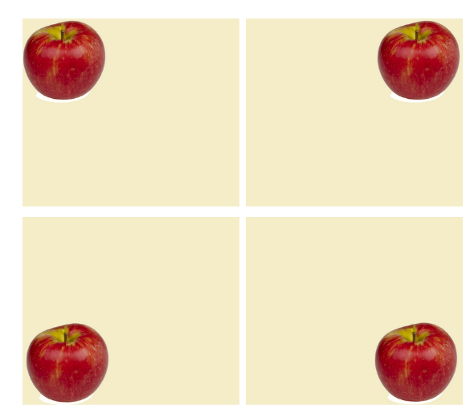

Machine learning methods used for classification, detection, or segmentation in Computer Vision require data. A lot of data. This data, represented by multidimensional matrices, are used in the learning process to select appropriate neural network parameters.
The number of parameters in a neural network depends on its architecture and can reach tremendous values. For example, popular neural networks, ResNet-50 and Resnet-101, consist of 23 and 44 billion parameters. **The dataset used for training of those networks must be proportionally large. So we need data. Tonnes of data.**

# Data augmentation - when we need data, a lot of data

**Data augmentation is a process whose primary goal is to extend the size of a dataset used to train a neural network to increase its efficiency and reduce overfitting.** In many cases, this technique makes it possible to develop an effective machine learning solution despite a small dataset. However, it is hard to define what exactly “large dataset” means.

# So, what is “large” enough?

For example, datasets such as QuickDraw, MNIST (Modified National Institute of Standards and Technology database), or Retinal OCT consisting of 3 billion, 70 000 and 85 000 images can be called large. However, many potentially valuable collections, such as Chest X-ray images, contain much smaller amounts of entries - just over 5800 images. **The TACO dataset of waste in environment have only 1500 annotated images.**

# Let’s rotate it!

There are many methods to expand the size of a data set. Searching for additional sets can be useful, but it is not always necessary. Neural networks treat every provided image as unique. That's why any geometric changes, such as changes in the arrangement of objects, will effectively increase the size of a database containing images.

# Random scaling

Another useful technique is **image scaling**. The images can be scaled in two ways - **inward** and **outward**.
Scaling outwards will increase the final image's size relative to the original one (zoom out). What is important, most frameworks will cut the object from the enlarged image to keep the initial size of the picture. Scaling inward (zoom in), the opposite.

We can also use **data cropping** that involves random sampling of a section from the original image and scales it outward to maintain the original size.

# It’s not only about the size

**Geometric transformations** that include the above-discussed changes in position, rotation, reflection, scaling, or cropping allow creating bigger datasets without any new data. These changes also increase the final network's effectiveness, as they exclude the data's homogeneity and reduce the possibility of biases caused by object position and orientation.

# The beets and the bias  

To better understand the benefits of such simple techniques, let's analyze a case where the neural network is trained to distinguish radishes from beets. The dataset used to train the network only contained photos of radishes placed vertically and beets placed horizontally (as in the figure below). The result may be erroneous despite obtaining high efficiency in the training process. The neural network will make incorrect decisions based on the most distinctive input image characteristic – orientation of the vegetable. So, it will be biased. Neural networks are looking for the most visible differences between the classes when learning how to classify objects.

# It’s just the beginning!

Geometrical changes represent only a small part of possible augmentation methods. There are many other techniques one can use to increase the size of a dataset quickly. We will describe other basic augmentation methods, such as noising, color modifications, or random cropping, in the next post. Stay tuned!
