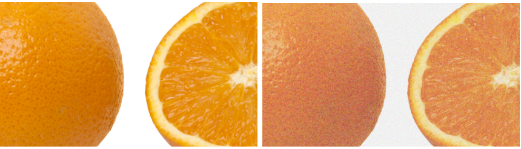
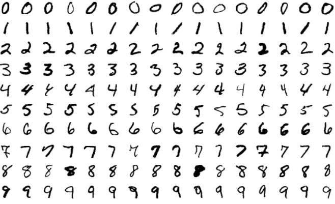
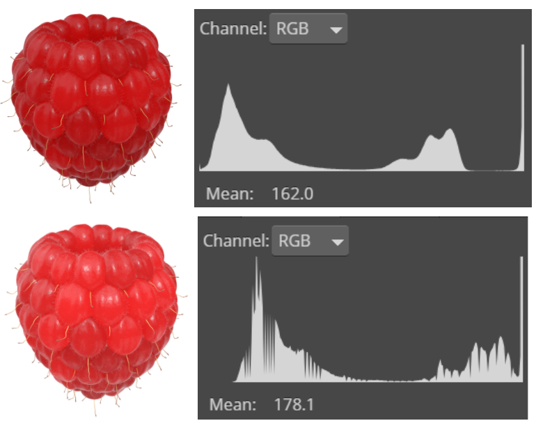

In the [previous post](https://detectwaste.ml/post/04-data-augmentation/) of our small series called “Data Augmentation”, we introduced fundamental geometrical transformations. They can be very useful for the artificial expansion of an input dataset and hence increase the neural network’s efficiency and reduce overfitting. But there are many other techniques which can help us as well, such as adding noise, color modifications, filtering, or cropping.

# Adding noise

**Adding noise** is another commonly used method of dataset augmentation. Gaussian noise with zero mean-value can effectively distort high-frequency features such as patterns, which are a common cause of network overlearning. Adding enough noise reduces the likelihood of network overfitting and can improve learning ability.
Salt and pepper noise using random black and white pixels scattered across an image produces similar effects as using standard Gaussian noise but may have a lower level of information distortion. So, it’s basically **better**.

# Colors modification

**Color modification** is another method that can provide a bigger image variety. This technique offers a more extensive set and increases the effectiveness of a neural network in real-world use. An example illustrating the need for this technique can be the use of the MNIST dataset to train a neural network which provides 70,000 images of handwriting.

All digits are written using black color (pixel value 255) on a white background (pixel value 0). Suppose the input dataset wasn't augmented with this technique. In that case, the trained model will not be effective when the colors are inverted, despite being highly effective on data that preserves the original colors. 

Changing colors can also be accomplished by **extracting individual color layers** in the RGB model or **editing the histogram** to adjust the brightness.

Another method of dataset augmentation that involves changing colors is the **color space transformation**. This technique change adds or subtracts a fixed value to pixels in individual channels. There are various variations of the method, such as modifying values in more than one channel simultaneously.

# Filtering

Image filtering involves performing specific modifications to pixel values within a range defined by the filter kernel size. It typically results in blurred or sharpened graphics. Thanks to this type of data augmentation, the network gains more information about the details (in case of sharpening) and allows the target model to work with lower quality data than the training data (in case of blurring).

# Random cropping

This technique is inspired by the mechanisms of regularization, which has its origin in statistics. In neural networks training, the purpose of regularization is to exclude some parameters from the computation. Random cropping is a process that is analogous to model regularization but is performed on a training dataset. It prevents overfitting to specific features.

# Agmentaton implementation

Basic data augmentation, which consists of the techniques mentioned above and in a previous article, can be accomplished in two ways. **Offline augmentation** involves manual enlargement of the physical dataset used for future network learning. The other approach involves incorporating the transformation of the existing dataset into the network learning process preparation. In this method, mini-batches (mini-sets) are modified just before feeding into the network. This way is called **online augmentation**.
The selection of an appropriate augmentation method depends on the size of the dataset. In offline augmentation, the dataset's size will be equal to the base size multiplied by the number of performed transformations. 

# When basic method is not enough

Basic augmentation methods are beneficial for creating bigger datasets for neural-networks learning but are not always applicable in real-life implementations of machine learning. For example, the weather assessment system must analyze the whole image to determine the weather on a picture correctly and won't work correctly on its components. A neural network needs to understand that specific image, such as a beach picture, can come in different versions: sunny, rainy, or even covered in snow.
Such cases require more advanced data augmentation techniques, such as GANs or interpolation. They will be discussed in the next post.
