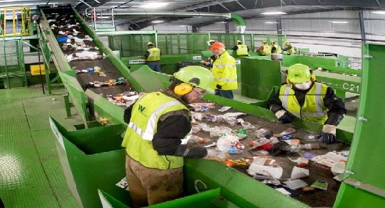
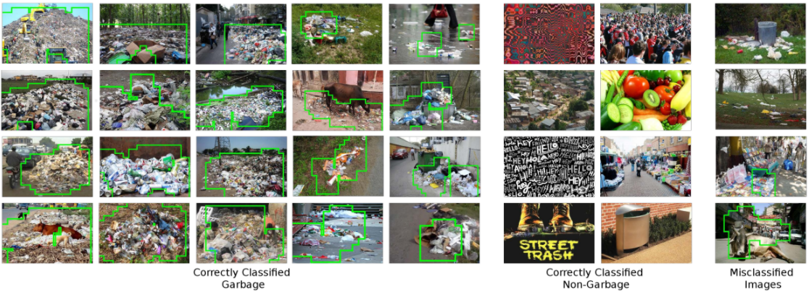

Trash is everywhere. Left uncollected, it often ends up harming the environment. To clean it up efficiently, we need to learn how to recycle it, and localize the places that are most contaminated. But before we move on to more decisive actions, we must realize what obstacles lie ahead.

**The most difficult challenge is the lack of clearly defined, uniform guidelines regarding the principles of segregation.** During our project, we realized that there is no single principled approach explaining the correct segregation of waste. For example the "chips package" discussed with our annotators team, by someone can be treated as waste belonging to the metals and plastic group, and by others as waste belonging to the non-recyclable group,  due to the variety of types of plastic material (not all are recyclable) it is made of.

Manual recycle process in factory.

On the other hand, **waste is commonly found in a wide variety of environments.** Both indoor and outdoor environments such as household, office, road and pavement scenes, and even under water. This diversity must be well represented in the training set presented to the detector to obtain good results. And at this point we come back to the problem of the lack of access to large amounts of annotated data that is necessary in the machine learning process.

Of course, litter detection is such a common problem that these issues were already faced by many researchers, and some solutions were already proposed. In this post I will describe how scientists have approached the problem of locating and recognizing the type of garbage from images using artificial intelligence.

# First step - classification

The most frequently quoted work, that started it all, is a [student project](https://github.com/garythung/trashnet). Yang and Thung from Stanford University collected the TrashNet dataset of 2500 images of single pieces of waste, and classified them into six classes consisting of glass, paper, metal, plastic, cardboard, and trash. The dataset is well balanced (almost ~500 images per category), but consists of photographs of one piece of garbage taken only on a white background. Authors compared the performance of deep models, and pointed out that the use of convolution neural networks (CNN) for classification of trash into various recycling categories was possible, but it would require collecting a larger and good quality data. 

In next approaches scientists tried to train variety CNNs to propose the best training scenario. They, for example, dealt with some augmentation methods (like rotation and flipping) or recent optimization algorithms (like Adam and Adadelta optimizers). In the end the satisfactory results (accuracy above 95%) were obtained, **confirming the possibility of using artificial intelligence to carry out the task of segregating garbage.** At the same time the need to enlarge the publicly available dataset again was emphasized.

 Examples of images from <a href="https://github.com/garythung/trashnet">TrashNet</a>.

# Next step - localization

New annotated dataset was introduced in 2016 and called [Garbage In Images](https://github.com/spotgarbage/spotgarbage-GINI) (GINI). Collection was created by using Bing Image Search API. The authors of this GINI dataset proposed GrabNet architecture, which on the GINI Dataset reached an accuracy of 87.69% for the task of the detection of garbage - localization of all trash in the image by scratching a bounding polygon around it. However, GarbNet provided no details about types of waste present in the image, and produced wrong predictions for waste seen in the distance. Another approach to locate the garbage (one class) in an image resulted in the fusion of the garbage dataset with several other datasets of common objects in urban scenes. Authors reached an accuracy of 89%. However, the model produced false positives when in an image there were also other objects in addition to waste. A different end-to-end approach has been proposed for the detection and classification of [garbage underwater](http://irvlab.cs.umn.edu/projects/detection-marine-debris). The four network architectures selected for this project were chosen from the most popular and successful object detection networks. The best model (Faster RCNN with Inceptionv2 backbone) achieved accuracy of 81%, but faltered in terms of inference time.

 Predictions from GrabNet on <a href="https://github.com/spotgarbage/spotgarbage-GINI">GINI dataset</a>.

# Recent achievements in waste detection task

[TACO dataset](http://tacodataset.org/), which we finally decided to use, can be used in methods that involve a segmentation component - we know the exact object boundary, not only the bounding box. Best accuracy for the TACO in one class instance segmentation task was around 20%. **The big challenges are the large imbalance of the dataset itself, diverse outdoor backgrounds, and a large variety within a single class label** (more about TACO dataset statistics you can find in our [previous post](https://detectwaste.ml/post/02-data-analysis/)). [Chinese scientists](https://github.com/realwecan/mju-waste/) decided to face this. They were solving a problem of two-class (waste vs. background) semantic segmentation task. The task of semantic segmentation relies on assignment of each pixel of the image to the appropriate category. This approach allowed them to get high quality segmentation results with 96.07% mean Pixel Precision on TACO dataset and 97.14% for MJU-Waste dataset, which they created from indoor photos of waste. Recently for semantic segmentation tasks, a novel dataset [TrashCan](https://conservancy.umn.edu/handle/11299/214865) to detect garbage underwater was also created. In this case, the simultaneous location and classification of objects also fared much worse.

 Example annotations for three segmentation datasets.

# Our goal

In the Detect Waste in Pomerania project we focused on the problem of waste detection in the environment. Due to the poor availability of a large public dataset of annotated images of trash, we decided to divide our tasks into two stages. In the first step we mixed all found datasets with instance-level annotations (bounding boxes) to perform one class detection. The next step was to perform a classification of the found rubbish with even greater class granularity than planned at the beginning of the project. We will describe achieved results soon. Stay tuned!

Did you find this post helpful? Check for more literature review [here](https://github.com/majsylw/litter-detection-review).
