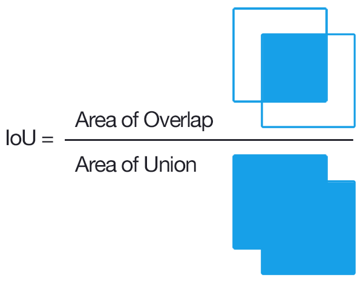

In our [previous post](https://detectwaste.ml/post/06-review-papers/) we wrote about various approaches to garbage segregation using artificial intelligence that have been made over the last few years. We compared their performance qualitatively, indicating on what types of data, they do well, and when they fail. In this post we will define the way to compare it quantitatively using some well-known metrics.

# Object detection and classification

Image classification, and object detection are one of the fundamental tasks in computer vision and they have been widely studied in the past decades. **When classifying images, we label the image by its category**. On the other hand, **object detection consists of locating a given object in the image and naming it** - localization + classification. So it is a natural extension of the image classification technique. Detected object can be surrounded by a bounding box - the smallest rectangle that will surround its shape - defined, for example, by indicating the position of its opposite vertices (x and y coordinates per these pixels in the image).

# Which prediction is the better one?

One of the metrics we most often use for evaluating classification models is **Accuracy**. Simply put, accuracy is the fraction of predictions that a trained model got right. In case of object detection, we first need to understand **Intersection over Union** (IoU) score. The IoU is given by the ratio of the intersection area and the union area of the predicted bounding box and the ground truth (annotated) bounding box. For bigger IoU, bounding boxes overlap more, so detection is better. In this task, a number of detected objects, with IoU above some threshold (usually 0.5) and proper class assignment, we treat as **True Positive** (TP). **False Positive** (FP) indicates a number of detected instances that should not be detected or were detected in insufficiently good position (too low IoU), and **False Negative** (FN) - number of objects that were not detected at all.

Having these values, we can construct equations for **Precision** and **Recall** as
Precision = TP / (TP + FP),
Recall = TP / (TP + FN).
Precision says how many of detected objects are really existing in analized image, and Recall shows how many objects that should be detected, were detected. This means that low Recall indicates that many objects were not detected, and low Precision - we have too many FP.

The most common approach to end with a single value allowing for model comparison is calculating **Average Precision** (AP) – calculated for a single object class across all test images, and finally **mean Average Precision** (mAP) – single value that is the mean of AP over all the possible classes. AP for a given class is computed as the weighted mean of precisions achieved at multiple IoU thresholds, with the increase in recall from the previous threshold used as the weight. This score corresponds to the area under the precision-recall curve. In case of PASCAL VOC challenge IoU=0.5 is used, in case of COCO - it is an average of AP for IoU thresholds from 0.5 to 0.95 with a step size of 0.05.

# To sum up

Now, armed with this knowledge, we can present the results of our experiments. But that will be material for the next posts. Stay tuned!
