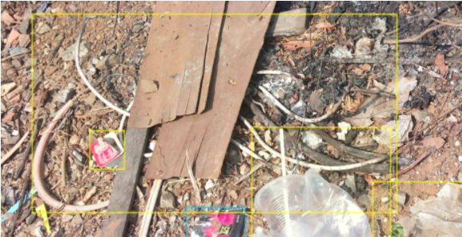
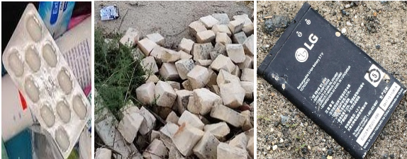
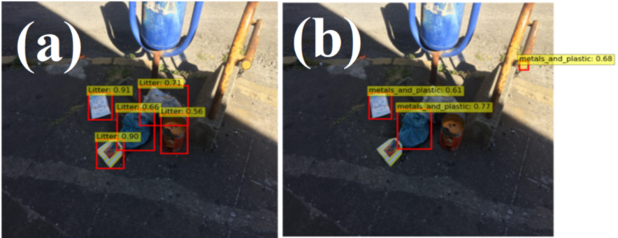

We have been struggling with the task of detecting garbage in the environment for almost 5 months. In our [previous post](https://detectwaste.ml/post/08-basic-metrics/) we described some metrics to compare performance achieved by different models. Now is the time to present our first results.

# Let's get back to the data

In the Detect Waste in Pomerania project we intended to base our research on [TACO dataset](http://tacodataset.org/) -  an open image dataset of waste in the environment. As we wrote in one of our [first posts](https://detectwaste.ml/post/02-data-analysis/), we converted TACO categories to detect waste categories according to the obligatory segregation rules of the city of Gdańsk. Additionally, around 3k images were tagged by our partner [Epinote](https://epinote.ai/) with bounding boxes. In this way, we started with waste detection performed for 6 classes - paper, glass, metal and plastic, bio, non-recyclable, and other - on an extended TACO dataset (almost 4.5k images).

Unfortunately, there are types of waste that do not fall into any of above-mentioned categories - very crowded photos with garbage obscured by various objects, where it was not possible to tag individual garbage, and trash that could not be clearly identified due to their state of degradation. We have created another category for it - **"unknown"**.



<center>
<span style="color:grey; font-size:1em;"> Crowded and hard to recognize waste from TACO dataset.</span>
</center>

## Detecting only metal and plastic in 7-class detection challenge

We conducted our experiments on an EfficientDet network, written in [PyTorch](https://github.com/rwightman/efficientdet-pytorch). EfficientDet is a family of object detection models that came out of the Google Brain team. It is based on the [EfficientNet paper](https://arxiv.org/pdf/1905.11946.pdf), which achieves one of the best performances on the image classification task. In our case EffcientDet-D2 gave us the best possible results. Smaller architectures got lower scores, whereas bigger ones quickly overfitted. **We hypothesize this is because the dataset itself is small (roughly 4.5k images) and highly imbalanced.**

<div style="text-align: center;">
<div style="display:inline-block;">

| <sub>model</sub>\\<sup>metric</sup>    | ```mAP@0.5``` | AP<sub>other</sub> | AP<sub>plastic&metal</sub> | AP<sub>bio</sub> | AP<sub>non-recyclable</sub> | AP<sub>glass</sub> | AP<sub>paper</sub> | AP<sub>unknown</sub> |
|-----------------|---------|---------|-----------------|-------|------------------|---------|---------|-----------|
| Efficientdet-D2 | 18.78   | 0.61    | 50.89           | 0.00  | 15.03            | 25.11   | 22.39   | 17.53     |
</div>
<center>
<span style="color:grey; font-size:1em;">Average Precision (AP) at IoU=0.5 achieved for TACO with EfficientDet-D2.</span>
</center>
</div>
<br>

The best result was recorded for the *“metal and plastic”* class. It is not surprising at all, considering the fact that a given class makes up almost 45% of our imbalanced dataset. Generalizing, our model treated almost every object it found as a plastic one. The worst results were achieved for the smallest class - *“bio”* with only 69 instances (0.5% of the dataset). The *“other”* class was also not very successful due to the large variety of other item’s kinds (from rubble to medicines).


<center>
<span style="color:grey; font-size:1em;"> Some example instances from poorly recognized class <i>“other”</i>, like medicines, rubble, and batteries.</span>
</center>

## Sometimes less is more: 1-class detection task

Detection combines two tasks: localization and classification of the objects in the image. We have noticed that our model performs quite well when localizing waste but works poorly with classification. Moreover, we have massive data from [OpenLitterMap](https://openlittermap.com/), with thousands of images labeled for the multi-label classification task (few categories in one image). We have decided to try single class detection instead, and separate classification. This allowed us to obtain an Average Precision (AP) on one litter class above 50%, which is a much better result than the one reported in the [article](https://arxiv.org/pdf/2003.06975.pdf) describing the detection on one-class TACO (16%). 

<div style="text-align: center;">
<div style="display:inline-block;">

|   <sub>model</sub>\\<sup>metric</sup>  | ```AP@0.5``` |
|:---------------:|:-------:|
| Efficientdet-D0 |  51.11  |
| Efficientdet-D1 |  56.24  |
| ***Efficientdet-D2*** |  ***61.05***  |
| Efficientdet-D3 |  60.63  |
</div>
<center>
<span style="color:grey; font-size:1em;">Average Precision achieved for one-class TACO with EfficientDet of different sizes.</span>
</center>
</div>
<br>


<center>
<span style="color:grey; font-size:1em;">Some example predictions made by: (a) 1-class, and (b) 7-class approach.</span>
</center>

# Future works

Good results, obtained for detection in a single class, prompted us to dive into these studies also on other datasets - representing the detection or segmentation of waste in various environments. This is the first post in a series describing our results for garbage detection on public datasets. Look out for more soon.
