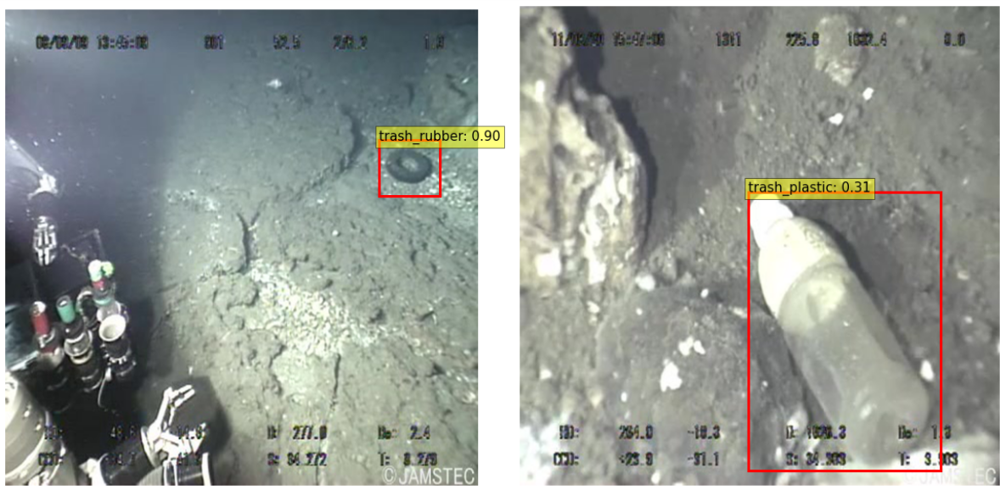

Existing datasets do not provide a large number of object classes with sufficient training data. In addition, as we managed to find out, differentiating waste instances under a single class label is also challenging. In this regard, we decided to formulate our problem as a one-class object detection. This allowed us to obtain high quality results as we had demonstrated previously with our experiments.

# Results on public datasets of annotated images of trash

As we wrote in our [previous post](https://detectwaste.ml/post/06-review-papers/) litter segregation and localization is a common problem. There are some public datasets  allowing for detection of waste in different environments. We tested chosen by us Efficientdet D-2 network on few of them.

<div style="text-align: center;">
<div style="display:inline-block;">

|    Dataset    | # classes | # images |                         Comment                        | ```mAP@0.5``` |
|:-------------:|:---------:|:--------:|:------------------------------------------------------:|:-------:|
|  [drink-waste](https://www.kaggle.com/arkadiyhacks/drinking-waste-classification)  |     4     |   9 640  |       indoor, plain background (cans and bottles)      |  99.60  |
|   [mju-waste](https://github.com/realwecan/mju-waste/)   |     1     |   2 475  |     indoor, in hand (mostly in the center of image)    |  97.74  |
|    [TrashCan](https://conservancy.umn.edu/handle/11299/214865)   |     8     |   7 212  |               underwater, frames of video              |  91.28  |
|    [UAVVaste](https://github.com/UAVVaste/UAVVaste)   |     1     |    772   |     waste in the wild, drone photos (small objects)    |  79.90  |
| [extended TACO](http://tacodataset.org/stats) |     1     |   4614   |          waste in the wild, diverse background         |  61.05  |
|    [Wade-AI](https://github.com/letsdoitworld/wade-ai/tree/master/Trash_Detection/trash/dataset)    |     1     |   1 400  |    waste in the wild, images from Google Street View   |  33.03  |
| [extended TACO](http://tacodataset.org/stats) |     7     |   4614   |          waste in the wild, diverse background         |  18.78  |
| [Trash ICRA-19](https://conservancy.umn.edu/handle/11299/214366) |     7     |   5 700  | underwater, selected trash categories, frames of video |   9.47  |
</div>
<center>
<span style="color:grey; font-size:1em;">Mean Average Precision (mAP) achieved for public waste datasets with EfficientDet D2.</span>
</center>
</div>

## Indoor scenario

The best score was achieved for the drink-waste dataset from the kaggle challenge. The dataset contains almost 10k images grouped by 4 classes of drinking waste: aluminium cans, glass bottles, PET (plastic) bottles and HDPE (plastic) milk bottles. Such **a high accuracy of detection (and classification) can be explained by the big size of the collection and the simplicity of its construction** - the same objects in the photos are presented against a uniform background in various positions. Despite the much smaller number of photos, the detection on the MJU-Waste dataset is characterized by high average precision.


<center>
<span style="color:grey; font-size:1em;">Sample predictions for indoor datasets - drink-waste (left), mju-waste (right) - consist of mostly one instance per image and only few images with multiclass instances for drink-waste dataset.</span>
</center>

## Underwater videos

Surprisingly very good results were also obtained for the underwater photos from the TrashCan collection, while the worst result was reported for Trash ICRA-19 underwater dataset. These photos are quite distorted, waste is often obscured by other objects, and at the same time images are the frames extracted from videos. Additionally we selected annotations only for trash categories, but left images with many different types of biological objects such as plants and animals, and remotely operated underwater vehicles (ROVs), as empty samples (images without any waste). This approach could lead to a deterioration of the results. In case of underwater photos, we also observed that the detector performed well in case of localization, but failed in case of classification of trash for 7 classes: <i>'plastic', 'paper', 'unknown', 'cloth', 'rubber', 'metal', 'wood'</i>.



<center>
<span style="color:grey; font-size:1em;">Sample predictions for underwater datasets: TrashCan (above), and ICRA-19 (below). In the case of ICRA-19 almost every trash was classified as plastic.</span>
</center>

## Detect trash in the wild

In the case of detecting rubbish in nature, the best results were obtained for the UAVVaste dataset collected by drone rubbish detection intelligent technology. The dataset is quite small, but is intended to be expanded. Additionally it is used for object detection evaluation benchmarking. Wade-AI dataset consists of Google Street View images, in which by segmentation mask whole piles of garbage were annotated. In the case of detection (when we use bounding boxes), this resulted in the marking of the entire landfill, not individual waste, and hence, as we suspect, the AP at the level of 33%. For the sake of completeness, we have made up the table with the results obtained for TACO: 7- and 1-class approaches (for details see our [previous post](https://detectwaste.ml/post/09-taco-results/)).


<center>
<span style="color:grey; font-size:1em;">Sample predictions for waste in the wild datasets: UAVVaste (left) - all small objects are correctly localized, and Wade-AI (right) - detector localizes large piles of garbage.</span>
</center>
<br>

For more information about waste datasets please check [waste-datasets-review repository](https://github.com/AgaMiko/waste-datasets-review).

# Make predictions on all of them

In order to use all data from public datasets, we decided to perform a detection task on a combined set of roughly 36k images from various backgrounds. Additionally, in the Mask R-CNN model, we performed an instance segmentation task - the network assigned each pixel to one of two categories: <i>“litter”</i> and <i>“background”</i>. Labels were instance-aware.

<div style="text-align: center;">
<div style="display:inline-block;">

|          <sub>model</sub>\\<sup>metric</sup>      | iouType | ```AP@0.5``` |
|:-----------------------------:|:-------:|:------:|
|        Efficientdet-D2        |   bbox  |  74.81 |
|        Efficientdet-D3        |   bbox  |  74.53 |
|     Mask R-CNN (ResNet50)     |   segm  |  23.05 |
| Mask R-CNN (ResNeXt101 64x4d) |   segm  |  24.70 |
</div>
<center>
<span style="color:grey; font-size:1em;">Average Precision achieved for one-class detection and segmentation on mixed dataset.</span>
</center>
</div>
<br>

From the above table, we can see that the mean AP value has improved in comparison with one-class detection on the extended TACO dataset. Instance segmentation tasks are harder, and more demanding. They require even more manual annotation of the images: since Mask R-CNN uses polygons as its input, this time just dragging a box around trash was not enough. But as output we also achieved polygons, which are more accurate than bounding boxes, especially if we think about letting machines collect waste in the future - we need to know the exact edges of the instances of trash.


<center>
<span style="color:grey; font-size:1em;">Examples of Mask R-CNN (with ResNet50 backbone) predictions.</span>
</center>

# Conclusions

During the process of developing these models, our team has looked through thousands of images that are just full of piles of trash: in home, in the natural environment, on the street, in the sea, in countries around the world. At this point, we can determine the approximate location of the abandoned garbage in the image. The next step in our project will be to correctly classify the found trash.
