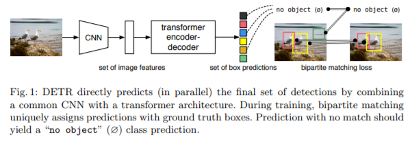
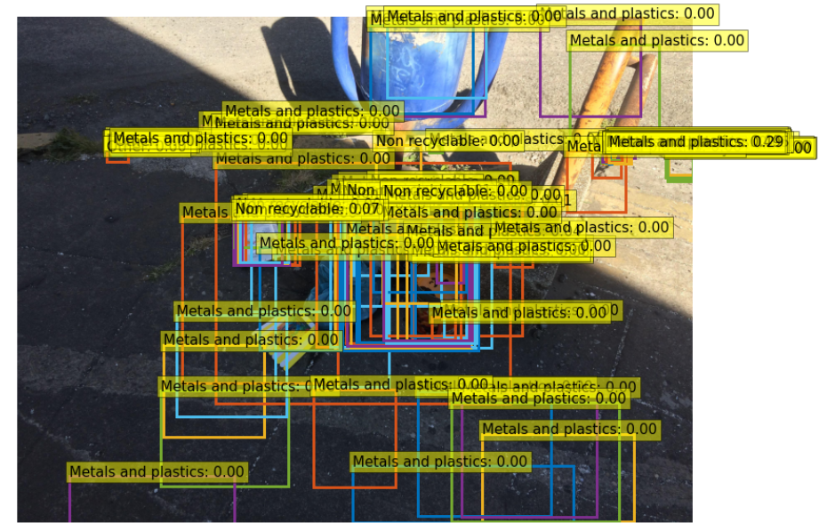
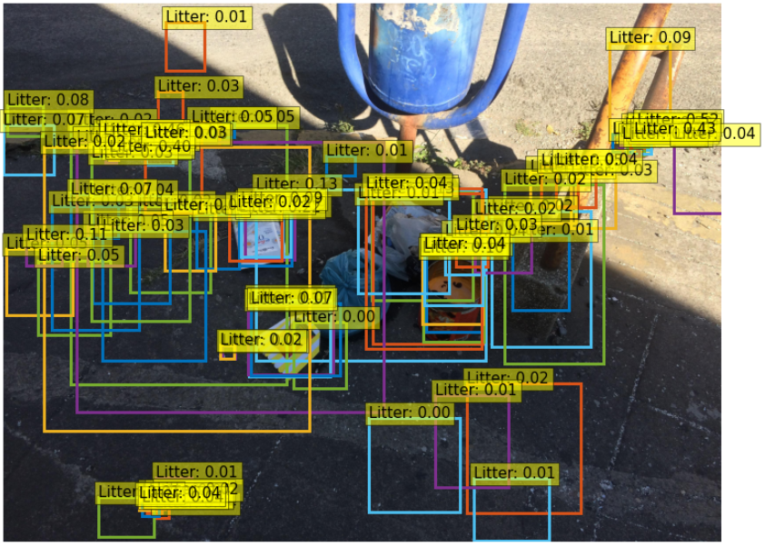
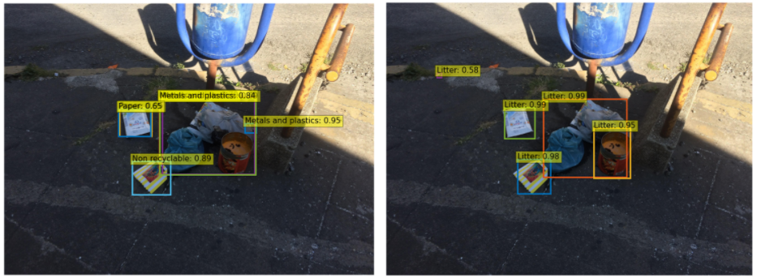
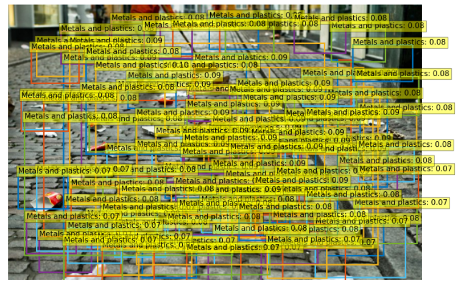
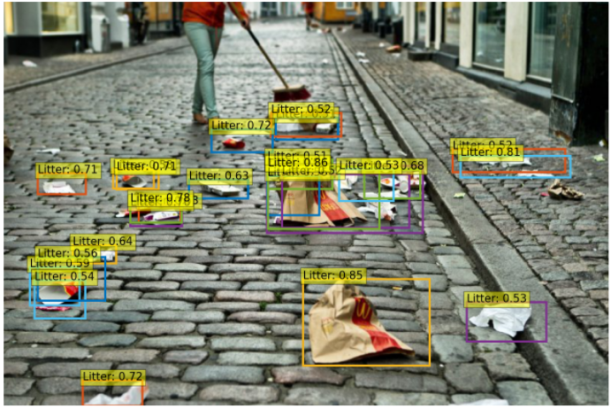
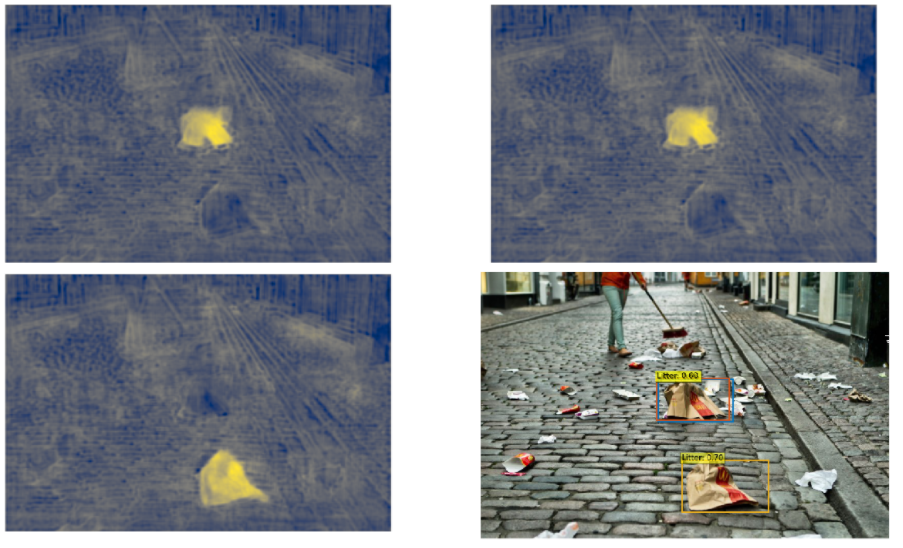

In all our previous articles, we tried to detect waste from high- and low-quality images taken from many public datasets. For this purpose, we used Efficientdet, a popular state-of-the-art model for object detection. Our main goal was to localize garbage from photos taken in various environmental conditions. In this article, we will try something a little different to solve this task - **DETR**, which stands for **DE**tection **TR**ansformer.

# Transformer evolutions in computer vision

Detr is a set-based object detector using a Transformer on top of a convolutional backbone. Transformer decoder is different from the originals. **For N inputs, at the same time, it is able to decode N outputs in parallel**, instead of decoding one element at time.

Architecture of DETR from Figure 1, section 1 in the <a href="https://arxiv.org/pdf/2005.12872.pdf">original paper</a>.

 

In comparison to well-known two- or one-stage detectors, **DETR does not need to set the number of anchor boxes** (prototypical bounding boxes being candidate regions of detected objects), or even threshold for [Non-Maximum Suppression (NMS)](https://arxiv.org/pdf/1704.04503.pdf) to filter out overlapping predicted bounding boxes.

## Performance of DETR on TACO dataset

For our experiments we adapt the source code provided by the [Facebook team](https://github.com/facebookresearch/detr) to make everything work with our data. You can take a look at the [detect-waste repository](https://github.com/wimlds-trojmiasto/detect-waste/tree/main/detr) and play with the code. We started by analyzing the performance of DETR on a [TACO dataset](http://tacodataset.org/).

In our studies we took into account some prerequisites. Firstly, we chose the ResNet-50 backbone pre-trained on ImageNet. Taking a pre-trained backbone is a common practice since **training from scratch is too long, and not effective enough**. Second, since the dataset we are using is small, **we loaded a pre-trained DETR model and finetuned it for detection of waste**. The original DETR was trained on a COCO dataset which contains 80 classes plus background, but in case of TACO, there are 6 classes plus background: paper, glass, metal and plastic, bio, non-recyclable, and other. Therefore, the few last layers of the pre-trained DETR (classification head) have different weight shapes and are not used. After this we launch a training and check the first results.

Unfortunately, in the beginning, our model did not really seem to get the idea of trash, which was mostly related to the small size of the dataset (only 1.5k images). Additionally, as was presented below, almost everything was treated as metal and plastic.

DETR output when detecting all 100 objects in the original image. On top of the rectangular boxes, we have the probability of the detected object. Almost every probability is below 0.1, which proves the great uncertainty of the model as to these predictions.

 

At this point we decided to simplify the task - teach model 2 classes: “litter” and “no object” (background). However, again the results were unsatisfactory.

DETR output for one class + “no object” mode on TACO dataset.

 

The salvation for the model performance was the delivery of ~3k annotated images from our partner [epinote](https://epinote.ai/).

Predictions made by 6-class + <i>“no object”</i> (left) and 1-class + <i>“no object”</i> (right) DETR for probability threshold set to 0.5.

 

## Taking it to the streets

At this point we had not yet incorporated the images from other waste datasets. Also in the case of evaluation, we did not go beyond TACO, for example to test model performance on images scraped from google search. To prepare the model for this challenge, we trained it for 300 epochs, and with a learning rate beginning with 0.0001 with drop at 100th epoch. In this way, during our development, the model output started from this (6-class + <i>“no object”</i> DETR trained on TACO dataset):

finally ended with this (1-class + <i>“no object”</i> DETR trained on mixed dataset):

What can be easily seen, **the performance of our model has increased significantly**. This emphasizes the importance of big amounts of good quality data in artificial intelligence tasks. Analyzing the above images, we can see also some objects that the model did not localize. These are mainly small, distant instances, which in general are hard to recognize for detectors (especially for the origin version of DETR).

## Simple comparison between Efficientdet and DETR

As mentioned in the introduction, in a [previous articles](https://detectwaste.ml/post/10-multidatasets-results/) we worked with Efficientdet detector. **In our case Efficientdet fared better, both in terms of the quality of the predictions performed and the training time**. On the other hand, the DETR’s pipeline can be easily extended to instance segmentation. But in the case of our mixed dataset this resulted mainly in the detection of grouped garbage - the model was losing the ability to identify individual instances. We suspect that this may be due to the annotation nature of some of the datasets used.

DETR’s action is based on attention mechanisms - it is easy to see what parts of an image the network is looking at when it makes a prediction.

 

Overall, this article was a shallow introduction to waste detection with DETR. More about our work can be found in our [github repo](https://github.com/wimlds-trojmiasto/detect-waste/blob/main/detr/notebooks).
