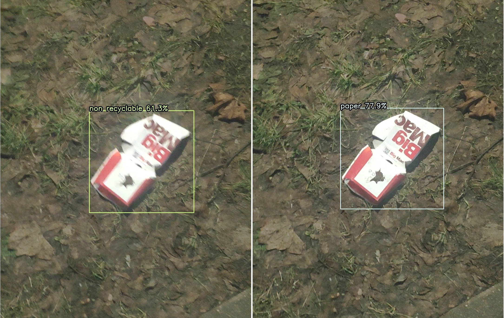

In the case of every deep learning project everything starts with a big amount of data.  In order to apply any supervised learning algorithm we need labelled data. Labelled data is expensive and difficult to get while unlabelled is cheaper. So, to solve specific types of problems, scientists defined a different type of learning known as semi-supervised learning, which uses both labelled data and unlabelled data. In this post we will show how a simple semi-supervised learning method called pseudo-labeling can be used to utilize unlabeled data.

# Data preprocessing and exploration

In this part of our research we focused on assigning garbage to the appropriate category. Detect waste categories were chosen according to the segregation rules of the city of Gdańsk. We were working with the following seven categories:
1. **metals and plastic**: metal and plastic rubbish such as beverage cans, beverage bottles, plastic shards, plastic food packaging, or plastic straws;
2. **paper**: paper items such as receipts, food packaging, newspapers, or cartons;
3. **glass**: glass objects such as glass bottles, jars, or broken glass;
4. **bio**: food waste such as fruit, vegetables, herbs;
5. **non-recyclable**: non-recyclable rubbish such as disposable diapers, pieces of string, polystyrene packaging, polystyrene elements, blankets, clothing, or used paper cups;
6. **other**: construction and demolition, large-size waste (e.g. tires), used electronics and household appliances, batteries, paint and varnish cans, or expired medicines;
7. **unknown**: hard to recognize, obscured objects.

Additionally we have added the eight class: background, because it was necessary to limit the amount of false positives coming out from our detector.

8. **background**: area without any litter, e.g.  a sidewalk, a forest path, a lawn.

## Training data

To train our litter classifier we have used the extended version of our litter detection dataset mentioned in [previous post](https://detectwaste.ml/post/10-multidatasets-results/). Check it out to learn about our results on many publicly available datasets for waste localization.
The idea behind building a dataset for waste classification was simple: gather as much data as possible, It was especially important for small classes such as bio or other. We broken it up into a few steps:
**Step 1.** Cut the litter from the detection dataset:  the annotated bounding boxes from our dataset can be also used as an input to the classifier.
**Step 2.** Use datasets prepared for classification: we have used data from TrashNet and waste pictures datasets.
**Step 3.** Scrap remaining data from the web:  to avoid huge data imbalance we have used Google Images Download to search and collect many images with bio and other waste, and also images that depicted scenes without the presence of garbage (background categories).

| Id |       Category       | # training images | # testing images |
|:--:|:--------------------:|:-----------------:|:----------------:|
| 0  | **background/no object** |        710        |        307       |
| 1  | **bio**                 |        122        |        39        |
| 2  | **glass**                |        1841       |        463       |
| 3  | **metals and plastic**   |        7710       |       1951       |
| 4  | **non recyclable**       |        2234       |        568       |
| 5  | **other**                |        390        |        130       |
| 6  | **paper**               |        1282       |        323       |
| 7  | **unknown**              |        2591       |        667       |

Number of images used for the final classification study.

 

This way we have gathered thousands of images that could be used for our task. However, we still had in mind that [OpenLitterMap](https://openlittermap.com/) offers an enormous number of litter images to use (~100k images). This is when we started to think about semi-supervised learning.

Semi-supervised learning uses both labelled and unlabelled data to improve the training process. One of the methods is pseudo labelling which is the process of using the model to predict labels for unlabelled data.

# Pseudo-labeling - the concept

In pseudo-labeling concept, we deal with a set of labeled data as well as a set of unlabeled data. The main idea is simple.
1. First, train the model on labeled data.
2. Then, use the trained model to predict labels on the unlabeled data - make pseudo-labels. Predictions will be treated as a ground-truth label for unlabelled data in the next step.
3. Mix pseudo-labels and true training labels and train models with it.
4. Repeat previous steps every batch or epoch.

Pseudo-labeling was introduced by Lee, more details about the method can be found in the [article](https://www.semanticscholar.org/paper/Pseudo-Label-%3A-The-Simple-and-Efficient-Learning-Lee/798d9840d2439a0e5d47bcf5d164aa46d5e7dc26).

Pseudo-labeling method.

 

## Pseudo-labeling in litter classification - 55k more images

As mentioned above we have used an unlabelled [OpenLitterMap](https://openlittermap.com/) dataset. OpenLitterMap is a dataset for multilabel classification so we had to predict bounding boxes and cut them from the images. We have used our best detector, namely EfficientDet-D2 trained on mixed dataset, to create pseudo bounding boxes to cut litter from images. With the power of pseudo-labelling we have extended our dataset by 55k new pictures. In the below table we present numbers of images used in our studies with some pre-assignment of litter class.

| Id |       Category       | # pseudo-labels |
|:--:|:--------------------:|:---------------:|
| 0  | **background/no object** |        -        |
| 1  | **bio**                  |        -        |
| 2  | **glass**                |       3136      |
| 3  | **metals and plastic**   |      29219      |
| 4  | **non recyclable**       |       1971      |
| 5  | **other**                |       900       |
| 6  | **paper**                |       819       |
| 7  | **unknown**              |      19701      |

Number of images used in pseudo-labeling method with some pre-assignment of litter class.

 

# The classifier - EfficientNets again

For the classification task we used the EfficientNet-B2 network, which also is a backbone in our best waste detector - EfficientDet-D2. [EfficientNet](https://arxiv.org/abs/1905.11946), used in our waste classification challenge, is a Convolutional Neural Network based on AutoML and Compound Scaling. Additionally, we used multiple data augmentation techniques, which are very important in the waste classification task. The instances of litter can assume different appearances depending on the environment in which they are located - in home, underwater or outside. Here, we applied some methods implemented in the [albumentations library](https://github.com/albumentations-team/albumentations).

## Our results

After running 20 epochs of training with a 0.0001 learning rate and batch size of 16 on our neural network with a almost 3/1 train/test split, we achieved a testing accuracy of 73.02% (and 86.67% training accuracy). Below we present the Confusion matrix, which shows that the vast majority of our samples from the test subset were classified correctly. The table also indicates a highly imbalance of the data.

Confusion matrix for test subset - id of labels are the same as in the tables.

 

Finally, we tested the classifier in combination with the detector on various video files to see how it behaved in real-world-scenario. Very good results were found in case of localization, the network was able to detect the majority of litter in non crowded images. Unfortunately their classification appears highly unstable - the same object in different frames was classified to various classes.

For some blurred frames the waste was classified as non recyclable, while in sharp cases to paper. Confidence given in the image is classification score.

# Conclusions

Pseudo-labeling allows us to utilize unlabeled data from OpenLitterMap while training classifiers. However this technique gave only a slight performance bust in case of litter detection tasks. This can be related to high imbalance and small amounts of labeled data, to which we had access, especially in case of bio or other classes. In the future the main goal will be to increase the performance of classification by balancing the number of images in the dataset.

Check out our Github repository for the implementation of [classifier](https://github.com/wimlds-trojmiasto/detect-waste/tree/main/classifier).
