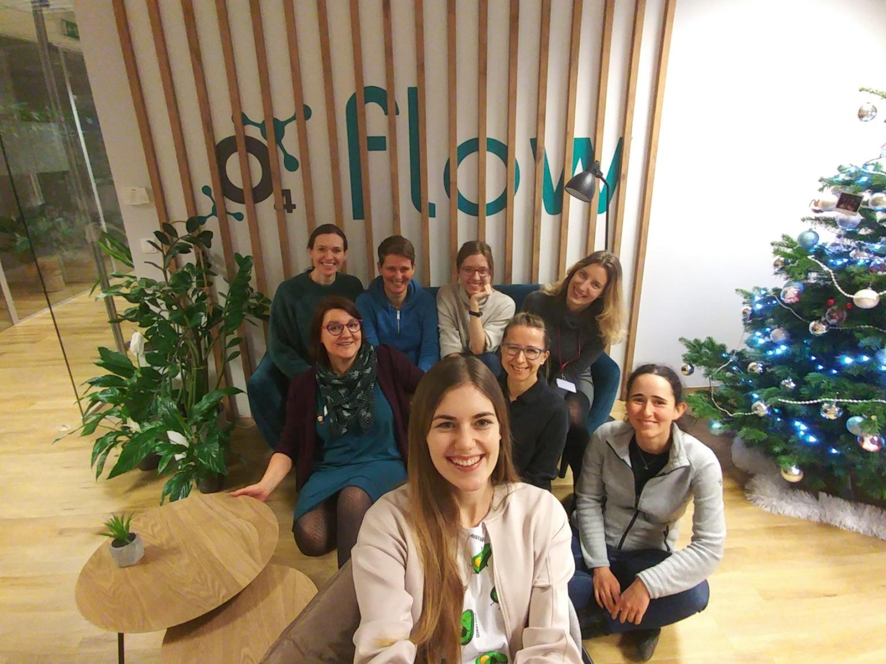
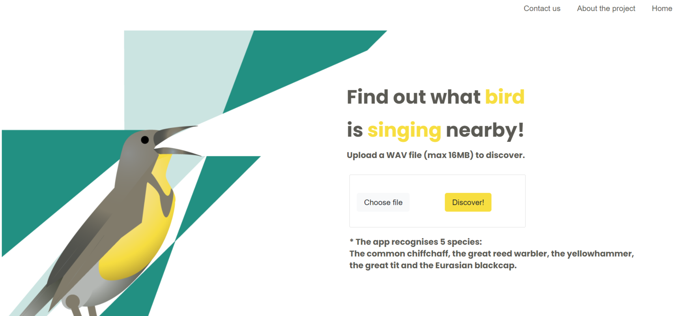

## Bird song recognition

This project was designed to be a collaboration on a real-life problem which machine learning can help to solve with a typical structure of a data science project including data research and analysis, data preparation, creation of models, analysis of results (or model improvement) and the final presentation. After the weeks of work, the group has managed to build a solution that predicts the right bird’s name with 87% accuracy on the test sample. Are you curious about the solution that has been built? We invite you to travel into a world of birds songs.

Female data scientists, PhD candidates, ornithologists, data analysts and software engineers who had prior experience with Python joined forces in a series of two-week-long sprints to work together on the project.

## What bird is singing nearby?

## Learn more about the project

Project's website: https://wimlds.voicelab.ai/

More about the project: 

Github repository: https://github.com/wimlds-trojmiasto/birds

More about birds recognition in AI: https://github.com/AgaMiko/bird-recognition-review

## Repostory with useful resources

During the project we have managed to gather tons of useful resources regarding birds' song analysis starting from datasets and papers, and ending on the open-source projects and challenges. Intrested? Feel free to check it out!
https://github.com/AgaMiko/Bird-recognition-review

Here is detailed list:
* [Datasets](https://github.com/AgaMiko/Bird-recognition-review/blob/master/README.md#Datasets)
* [Papers](https://github.com/AgaMiko/Bird-recognition-review/blob/master/README.md#Papers)
* [Open Source Projects](https://github.com/AgaMiko/Bird-recognition-review/blob/master/README.md#Open-Source-Projects)
* [Competitions](https://github.com/AgaMiko/Bird-recognition-review/blob/master/README.md#Competitions)
* [Articles](https://github.com/AgaMiko/Bird-recognition-review/blob/master/README.md#Articles)

