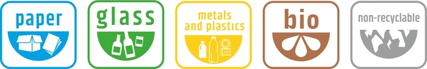
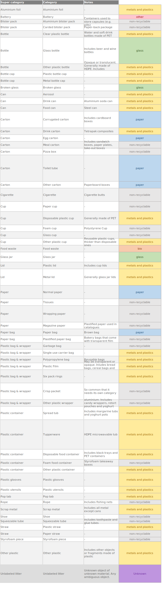

+++
# Waste categories
widget = "blank"  # See https://sourcethemes.com/academic/docs/page-builder/
headless = false  # This file represents a page section.
active = true  # Activate this widget? true/false
weight = 11  # Order that this section will appear in.

title = "Waste categories in detectwaste.ml"
subtitle = "Inspired by Gdansk "

[design]
  # Choose how many columns the section has. Valid values: 1 or 2.
  columns = "1"
  align = "center"
  
[design.spacing]
  # Customize the section spacing. Order is top, right, bottom, left.
  padding = ["60px", "0", "20px", "0"]
+++

Today, more than 300 million tons of plastic are produced annually. Plastic is everywhere and we constantly use it in our daily life.

The idea of *Plastic object detection project* is to use Artificial Intelligence to detect plastic waste in the environment. 
Our solution  will be applicable for video and photography.

Waste in Gdańsk is segregated into 5 distinctive categories:
* paper – clean and dry
* glass
* metal and plastic
* bio – without animal waste, fat or bones
* residual (non-recycable) waste
      

[More about waste segergation in Gdańsk](https://www.gdansk.pl/segregacja/ulotka_EN.pdf)

# TACO to detectwaste.ml
[Click here to download sheet](labels.xlsx)

### Preview

